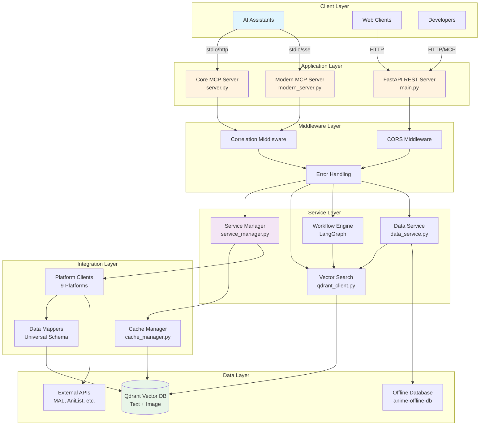
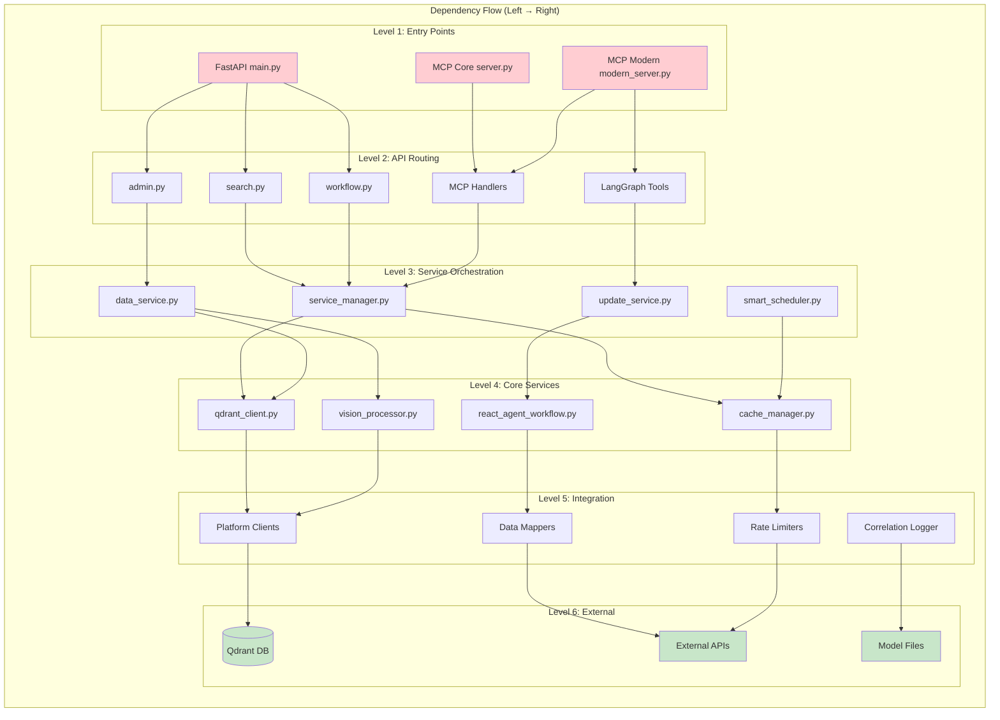
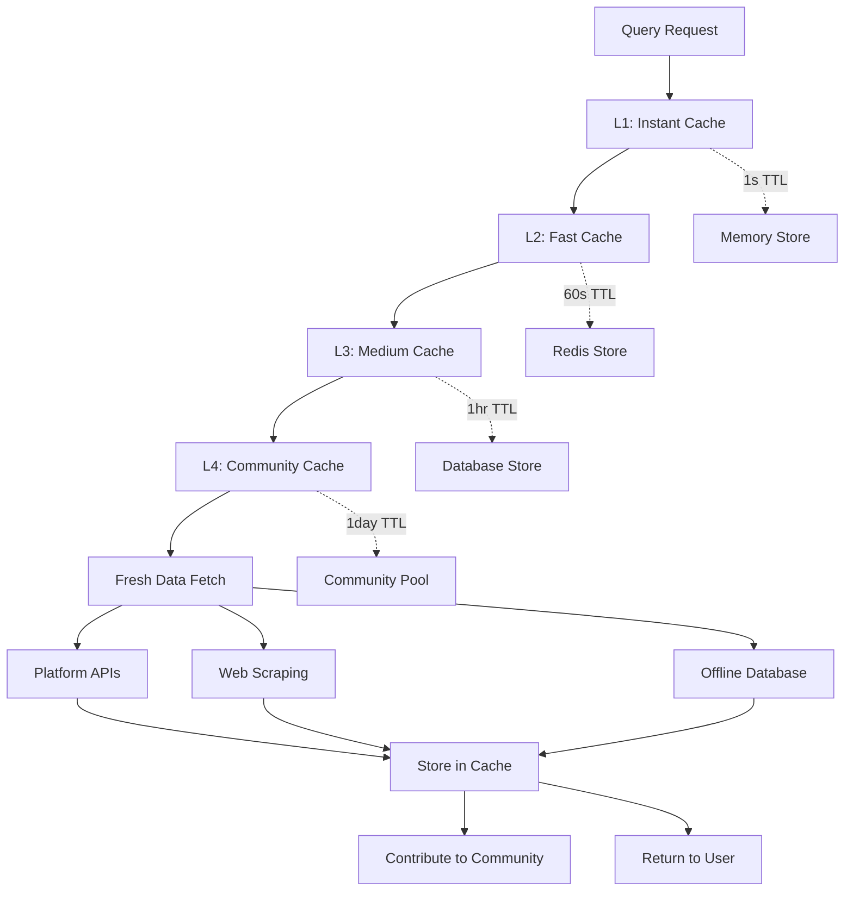
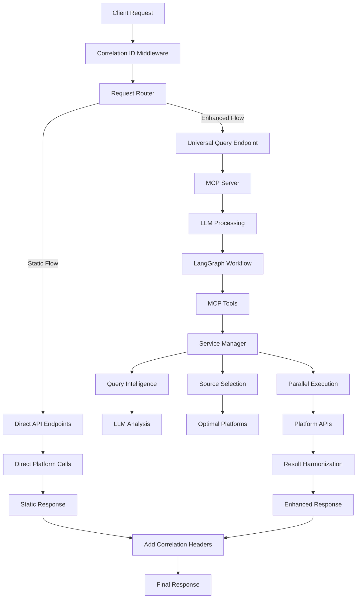

# System Architecture Documentation
# Anime MCP Server

## 1. High-Level Architecture Overview

The Anime MCP Server implements a **multi-protocol, AI-native architecture** designed for intelligent anime discovery and cross-platform data integration. The system operates as both a high-performance REST API and a Model Context Protocol (MCP) server, enabling seamless integration with AI assistants and developer applications.

### Core Architecture Principles

1. **API-First Design**: All functionality accessible via REST endpoints and MCP tools
2. **AI-Native Integration**: Built specifically for AI assistant workflows with conversational interfaces
3. **Microservices Architecture**: Modular components with clear separation of concerns
4. **Performance-Optimized**: Vector database with sub-200ms search response times
5. **Cross-Platform Unified**: Single interface for 8+ anime platform APIs
6. **Scalable Infrastructure**: Stateless design with Docker containerization

### System Architecture Overview



### Component Dependency Architecture



**Dependency Rules:**
- ✅ **Forward Dependencies Only**: Components may only depend on layers to the right
- ❌ **No Backward Dependencies**: Level N cannot import from Level N-1 or higher
- ❌ **No Cross-Layer Jumping**: Must go through intermediate layers
- ❌ **No Circular Dependencies**: Strictly enforced unidirectional flow

## 2. Architectural Constraints & Validation

### 2.1 Formal Architectural Constraints

```python
# Architectural Constraint Definitions
ARCHITECTURAL_CONSTRAINTS = {
    "dependency_flow": {
        "rule": "Unidirectional dependency flow only (Level N → Level N+1)",
        "enforcement": "STRICT",
        "violations": [
            "Service layer importing from API layer",
            "Data layer importing from Service layer", 
            "Cross-layer jumping (Level 1 → Level 3 directly)"
        ]
    },
    
    "api_isolation": {
        "rule": "MCP Tools MUST NOT call FastAPI endpoints directly",
        "enforcement": "STRICT",
        "rationale": "Prevents circular dependencies between protocols",
        "allowed": "MCP → Service Manager → Core Services",
        "forbidden": "MCP → FastAPI endpoints"
    },
    
    "external_access": {
        "rule": "Only Integration Layer may call external APIs",
        "enforcement": "STRICT", 
        "violations": [
            "API layer calling external services directly",
            "Service layer bypassing Integration layer"
        ]
    },
    
    "data_access": {
        "rule": "Vector database access only through qdrant_client.py",
        "enforcement": "STRICT",
        "rationale": "Centralized connection management and query optimization"
    },
    
    "state_management": {
        "rule": "Stateless design - no persistent state in application layer",
        "enforcement": "STRICT",
        "allowed_state": ["Cache layers", "Database", "External session state"]
    },
    
    "error_handling": {
        "rule": "All external calls must use correlation tracking",
        "enforcement": "RECOMMENDED",
        "implementation": "correlation_middleware.py"
    }
}
```

### 2.2 Change Validation Process

```python
# Pre-Change Validation Checklist
def validate_architectural_change(change_description: str) -> Dict[str, str]:
    """
    Validation process for any architectural changes
    """
    validation_checklist = {
        "dependency_analysis": {
            "question": "Does this change introduce backward dependencies?",
            "validation": "Check import statements and call graphs",
            "blocker": True
        },
        
        "separation_of_concerns": {
            "question": "Does this maintain single responsibility principle?",
            "validation": "Verify component focuses on one concern",
            "blocker": False
        },
        
        "interface_stability": {
            "question": "Are existing interfaces preserved or properly versioned?",
            "validation": "Check for breaking changes in public APIs",
            "blocker": True
        },
        
        "external_dependency": {
            "question": "Are new external dependencies properly isolated?",
            "validation": "Ensure external calls go through Integration Layer",
            "blocker": True
        },
        
        "performance_impact": {
            "question": "Does this maintain <200ms search response times?",
            "validation": "Run performance benchmarks",
            "blocker": False
        },
        
        "test_coverage": {
            "question": "Are changes covered by tests?",
            "validation": "Verify unit and integration test coverage",
            "blocker": True
        }
    }
    
    return validation_checklist
```

### 2.3 Architectural Violation Detection

```python
# Automated Constraint Checking
VIOLATION_PATTERNS = {
    "backward_dependency": {
        "pattern": r"from src\.(api|main) import",
        "locations": ["src/services/", "src/vector/", "src/integrations/"],
        "severity": "CRITICAL"
    },
    
    "direct_external_call": {
        "pattern": r"(requests\.|aiohttp\.|httpx\.)",
        "locations": ["src/api/", "src/services/", "src/anime_mcp/"],
        "allowed_files": ["src/integrations/clients/"],
        "severity": "HIGH"
    },
    
    "direct_database_access": {
        "pattern": r"qdrant_client\.QdrantClient",
        "locations": ["src/api/", "src/anime_mcp/"],
        "allowed_files": ["src/vector/qdrant_client.py"],
        "severity": "HIGH"
    },
    
    "state_violation": {
        "pattern": r"(global\s+\w+|class.*State)",
        "locations": ["src/api/", "src/anime_mcp/"],
        "severity": "MEDIUM"
    }
}
```

## 3. System Components

### 3.1 Application Layer

```

                     Application Layer                       
$
  FastAPI REST Server (main.py)       MCP Servers           
   Search Endpoints                 Core Server       
   Workflow Endpoints               Modern Server     
   Admin Endpoints                    (LangGraph)        
   External Platform APIs                                

```

**Key Files:**
- `src/main.py` - FastAPI application entry point with lifespan management
- `src/anime_mcp/server.py` - Core MCP server with 8 fundamental tools  
- `src/anime_mcp/modern_server.py` - Advanced MCP server with LangGraph workflows

### 3.2 Service Layer

```

                      Service Layer                          
$
  Vector Search        Workflow Engine      External APIs  
   QdrantClient      AnimeSwarm        8 Platforms 
   VisionProc       SearchAgent       Rate Limits 
   Embeddings       ScheduleAgent     Mappers     

```

**Current Implementation Status:**
- ✅ **FastAPI REST Server**: Production-ready with health monitoring
- ✅ **Core MCP Server**: 8 fundamental tools with multi-transport support
- ✅ **Modern MCP Server**: LangGraph workflows with ReactAgent
- ✅ **Service Manager**: FULLY IMPLEMENTED - Complete with intelligent routing (510+ lines)
- 🔄 **Universal Query Endpoint**: IN PROGRESS - API consolidation strategy (see Section 3.4)

**Key Components:**
- `src/vector/qdrant_client.py` - Multi-vector database operations
- `src/langgraph/anime_swarm.py` - Multi-agent workflow orchestration
- `src/integrations/` - External platform clients and mappers

### 3.3 Missing Critical Components (From PLANNING.md Analysis)

**🚨 BLOCKING ISSUES IDENTIFIED:**

1. **Service Manager (RESOLVED)**: `src/integrations/service_manager.py` - **FULLY IMPLEMENTED (511 lines)**
   - **Status**: ✅ FULLY IMPLEMENTED - Complete ServiceManager class operational
   - **Features**: Intelligent query routing, multi-source coordination, comprehensive fallback chains
   - **Capabilities**: Universal search, platform auto-selection, circuit breaker integration, health monitoring

2. **Collaborative Cache System (HIGH PRIORITY)**: `src/integrations/cache_manager.py`
   - **Status**: 🟡 STUB IMPLEMENTATION - Basic class structure only
   - **Impact**: No 5-tier caching, reduced performance, higher API costs
   - **Required**: Full 5-tier cache architecture with community sharing

3. **Universal Query Endpoint (IN PROGRESS)**: `/api/query` - API Consolidation Strategy
   - **Status**: 🔄 IN PROGRESS - Consolidating workflow endpoints into universal interface
   - **Strategy**: Rename and enhance existing `/api/workflow/conversation` → `/api/query`
   - **Foundation**: LangGraph ReactAgent + 8 MCP tools already operational
   - **Required**: Unified request/response models with auto-detection

### 3.4 API Consolidation Strategy (Current Sprint)

**Vision**: Transform from 15+ static endpoints to 2 universal endpoints for simplified LLM integration

**Current State Analysis**:
```
Existing Endpoints:
├── /api/search/*          (5+ endpoints)
├── /api/workflow/*        (3 endpoints) ← CONSOLIDATION TARGET
├── /api/admin/*           (3+ endpoints)
└── /api/external/*        (9+ endpoints)
```

**Consolidation Strategy**:
- **Phase 1**: Consolidate `/api/workflow/conversation`, `/api/workflow/multimodal`, `/api/workflow/smart-conversation` → `/api/query`
- **Foundation**: Existing LangGraph ReactAgent + 8 MCP tools (✅ already implemented)
- **Auto-Detection**: Single endpoint with intelligent routing based on request content
- **Backward Compatibility**: Maintain existing functionality during transition

**Target Architecture**:
```python
# Universal Query Endpoint
@router.post("/query", response_model=UniversalQueryResponse)
async def universal_query(request: UniversalQueryRequest):
    """Single endpoint for all LLM-driven anime queries with multimodal support"""
    # Auto-detect: text-only vs multimodal vs smart orchestration
    # Route internally to appropriate LangGraph workflow
    # Return unified response format
```

**Implementation Status**:
- 🔄 **API Consolidation**: Rename and enhance workflow endpoints
- 🔄 **Unified Models**: Create UniversalQueryRequest/Response 
- 🔄 **Auto-Detection**: Implement content-based routing logic
- ⏭️ **Multimodal Enhancement**: 4-phase roadmap for advanced capabilities

4. **Correlation ID & Tracing (FULLY IMPLEMENTED)**: Enterprise-grade correlation system with automated FastAPI integration
   - **Status**: ✅ FULLY COMPLETE - Core infrastructure + FastAPI middleware operational
   - **✅ Implemented**: Enterprise-grade correlation/tracing infrastructure (1,834+ lines)
     - CorrelationLogger: Full chain tracking with parent/child relationships
     - ExecutionTracer: Performance analytics with automatic metrics
     - ErrorContext: Three-layer error preservation with recovery suggestions
     - Client Integration: MAL, AniList, BaseClient with full correlation support
     - Service Integration: ServiceManager with correlation propagation
   - **✅ NEW (2025-07-06)**: FastAPI middleware for automatic correlation injection
     - CorrelationIDMiddleware: Auto-generation and header propagation
     - Request lifecycle logging with correlation context
     - API endpoint integration (search.py, admin.py)
     - Production-ready observability with zero breaking changes
   - **❌ Remaining**: MCP Tool Correlation Propagation (Low Priority)
   - **Impact**: Complete HTTP request traceability across application


### 3.4 Collaborative Cache Architecture (PLANNED)



**Cache Performance Targets:**
- **L1 Cache (Memory)**: 1GB limit, 5-15 min TTL, LRU eviction
- **L2 Cache (Redis)**: 10GB limit, 1-24 hour TTL, compression enabled
- **L3 Cache (Database)**: Unlimited, 24+ hour TTL, weekly refresh
- **Target Cache Hit Rate**: >70% (warning at <80%)

### 3.5 Request Flow Architecture



**Two Request Flows:**
1. **Static Flow**: FastAPI → Direct Platform Clients → Response
2. **Enhanced Flow**: FastAPI → MCP → LLM → LangGraph → Tools → Service Manager → Platform APIs → Response

**Circular Dependency Prevention**: Enhanced endpoints use MCP tools, NOT static API endpoints

### 3.6 Data Layer

```

                       Data Layer                            
$
  Qdrant Vector DB      External Sources     Processing     
   Text (384D)        MyAnimeList       FastEmbed  
   Picture (512D)     AniList           CLIP       
   Thumbnail (512D)   Kitsu + 5 more    Validation 

```

## 4. Detailed Component Architecture

### 4.1 FastAPI REST Server Architecture

```python
# Application Structure
src/main.py                    # Entry point with lifespan management
 Routers
    /api/search           # search.py - Core search endpoints
    /api/workflow         # workflow.py - LangGraph conversations  
    /api/admin            # admin.py - Database management
    /api/external         # Platform-specific endpoints
 Middleware
    CORS                  # Cross-origin resource sharing
    Error Handling        # Global exception handling
 Lifecycle
     Startup               # Qdrant initialization & health checks
     Shutdown              # Graceful MCP client disconnection
```

**Key Features:**
- **Centralized Configuration**: Single `Settings` class with validation
- **Global Qdrant Client**: Shared database connection with health monitoring
- **Automatic Documentation**: OpenAPI/Swagger with interactive testing
- **Error Handling**: Structured error responses with HTTP status codes
- **Correlation Middleware**: Automatic request tracing and observability (NEW 2025-07-06)


### 4.2 MCP Server Architecture

The system provides **two MCP server implementations** for different use cases:

#### Core MCP Server (`src/anime_mcp/server.py`)
```python
# Transport Support: stdio, http, sse, streamable
Tools (8):
 search_anime              # Semantic search with filtering
 get_anime_details         # Detailed anime information
 find_similar_anime        # Vector similarity search
 get_anime_stats          # Database statistics
 search_anime_by_image    # Image-based search
 find_visually_similar_anime # Visual similarity
 search_multimodal_anime  # Combined text+image
 anime_search_complex     # Advanced filtering

Resources (2):
 anime://server/capabilities
 anime://database/stats
```

#### Modern MCP Server (`src/anime_mcp/modern_server.py`)
```python
# Transport Support: stdio, sse
# LangGraph Integration: Multi-agent workflows

High-Level Tools (4):
 discover_anime           # AI-powered discovery workflow
 get_currently_airing_anime # Real-time broadcast schedules
 find_similar_anime_workflow # AI similarity analysis
 search_by_streaming_platform # Platform availability

Platform Tools (14):
 MyAnimeList (3 tools)    # search_anime_mal, get_anime_mal, get_mal_seasonal_anime
 AniList (2 tools)        # search_anime_anilist, get_anime_anilist
 Kitsu (3 tools)          # search_anime_kitsu, get_anime_kitsu, search_streaming_platforms
 Jikan (3 tools)          # search_anime_jikan, get_anime_jikan, get_jikan_seasonal
 AnimeSchedule (3 tools)  # search_anime_schedule, get_schedule_data, get_currently_airing

Vector Tools (3):
 anime_semantic_search    # Direct vector database access
 anime_similar           # Vector similarity
 anime_vector_stats      # Vector database statistics

Enrichment Tools (5):
 compare_anime_ratings_cross_platform
 get_cross_platform_anime_data
 correlate_anime_across_platforms
 get_streaming_availability_multi_platform
 detect_platform_discrepancies
```

### 4.3 Vector Database Architecture

```python
# Qdrant Multi-Vector Collection Design
Collection: "anime_database"
 Vectors
    "text" (384D)         # FastEmbed BAAI/bge-small-en-v1.5
    "picture" (512D)      # CLIP ViT-B/32 poster embeddings
    "thumbnail" (512D)    # CLIP ViT-B/32 thumbnail embeddings
 Payload
    anime_id (string)     # Unique identifier
    title (string)        # Primary title
    synopsis (string)     # Description text
    tags (array)          # Genres and themes
    studios (array)       # Animation studios
    year (integer)        # Release year
    season (string)       # Anime season
    myanimelist_id        # Platform cross-references
    anilist_id
    kitsu_id
    quality_score (float) # Data completeness (0-1)
 Indexing
     Distance Metric: Cosine
     Batch Size: 100 points
     Total Entries: 38,894+
```

**Search Capabilities:**
- **Semantic Text Search**: Natural language queries with vector similarity
- **Image Similarity**: Visual search using CLIP embeddings
- **Multimodal Search**: Combined text+image with weighted scoring
- **Filtered Search**: Year, genre, studio, exclusion filtering
- **Cross-Reference Lookup**: Platform ID to unified data mapping

### 4.4 LangGraph Workflow Architecture

```python
# Multi-Agent Workflow System
AnimeDiscoverySwarm
 Core Components
    QueryAnalyzer        # Intent detection and parameter extraction
    ConditionalRouter    # Intelligent agent routing
    SwarmErrorHandler    # Error recovery and fallback
    WorkflowState        # Conversation memory and context
 Specialized Agents
    SearchAgent          # Semantic and multimodal search
    ScheduleAgent        # Real-time broadcast data
    PlatformAgent        # Platform-specific operations
    EnrichmentAgent      # Cross-platform data correlation
 Workflow Features
     Session Persistence  # Conversation continuity
     Smart Orchestration  # Multi-step query processing
     Context Memory       # User preference learning
     Error Recovery       # Graceful degradation
```

**Workflow Types:**
1. **Standard Conversation**: Simple query � agent � response
2. **Smart Orchestration**: Complex query � multi-agent � enriched response  
3. **Multimodal Workflow**: Text + image � combined analysis � results
4. **Scheduled Discovery**: Real-time data � broadcast schedules � availability

## 5. Data Flow Architecture

### 5.1 Search Request Flow

```
User Request � FastAPI/MCP � Query Processing � Vector Search � Response
                                                             
                                                              JSON Response
                                                  Qdrant Vector DB
                                 Parameter Extraction/Validation
                   Route to search.py or MCP tool
     Natural Language Query
```

### 5.2 Multimodal Search Flow

```
Text + Image � Image Processing � Vector Generation � Combined Search � Results
                                                                    
                                                                     Weighted Results
                                                          Multi-vector Query
                                       CLIP Embeddings (512D)
                    PIL + torch + CLIP
      Base64 Image Data
```

### 5.3 Workflow Processing Flow

```
Complex Query � Query Analysis � Agent Routing � Multi-Step Processing � Enriched Response
                                                                            
                                                                             Structured Results
                                                         Cross-platform Data
                                     Specialized Agents
                      Intent Detection + Parameter Extraction
       "Find mecha anime but not violent and similar to gundam"
```

## 6. External Integration Architecture

### 6.1 Platform Integration Strategy

```python
# Unified Integration Pattern
Platform Integration
 Client Layer (integrations/clients/)
    Base Client          # Common HTTP client with rate limiting
    Platform Clients     # 8 specialized API clients
    Error Handling       # Retry logic and fallback strategies
 Mapping Layer (integrations/mappers/)
    Data Normalizers     # Platform-specific to unified schema
    Field Mappers        # Cross-platform field mapping
    Quality Validators   # Data completeness scoring
 Service Layer (services/external/)
     Platform Services    # Business logic and orchestration
     Rate Limiting        # Platform-specific rate strategies
     Cache Management     # Response caching and invalidation
```

**Supported Platforms:**
- **MyAnimeList**: Official API with OAuth (search, details, seasonal)
- **AniList**: GraphQL API with complex querying
- **Kitsu**: JSON:API with streaming platform data
- **AniDB**: HTTP API with comprehensive metadata
- **AnimeSchedule**: Real-time broadcast schedules
- **AnimePlanet**: Web scraping with advanced filtering
- **AniSearch**: European anime database integration
- **AnimeCountdown**: Release tracking and countdown data

### 6.2 Rate Limiting Architecture

```python
# Platform-Specific Rate Limiting
Rate Limiting Strategy
 MyAnimeList: 100 requests/minute
 AniList: No official limits (respectful usage)
 Kitsu: 500 requests/hour with burst allowance
 Jikan: 3 requests/second (MAL unofficial API)
 AnimeSchedule: 60 requests/minute
 Scraped Platforms: Conservative 1 request/second
```

## 7. Performance Architecture

### 7.1 Response Time Targets

```
Search Operations:
 Text Search: <200ms (95th percentile)
 Image Search: ~1 second (including CLIP processing)
 Multimodal Search: ~1.2 seconds (combined processing)
 Workflow Operations: <150ms (ToolNode optimization)
 Platform Queries: <500ms (with caching)
```

### 7.2 Caching Strategy

```python
# Multi-Level Caching Architecture
Caching Layers
 Vector Cache
    FastEmbed Model Cache    # Local model storage
    CLIP Model Cache         # Downloaded model persistence
    Embedding Cache          # Computed embeddings (memory)
 HTTP Cache
    Platform Response Cache  # 15-minute TTL
    Image Download Cache     # Persistent image storage
    Cross-Platform Cache     # ID correlation cache
 Application Cache
     Session Memory           # LangGraph conversation state
     User Context Cache       # Preference learning
     Statistics Cache         # Database stats (5-minute TTL)
```

## 8. Security Architecture

### 8.1 API Security

```python
# Security Measures
API Security
 Input Validation
    Pydantic Models         # Type-safe request validation
    Query Sanitization      # SQL injection prevention
    File Upload Limits      # 10MB max image size
 Rate Limiting
    Per-Client Limits       # 10 concurrent requests
    Global Rate Limits      # System-wide protection
    Platform Rate Respect   # External API protection
 Resource Protection
     Memory Limits           # Vector operation bounds
     Timeout Controls        # Request timeout limits
     Error Information       # Sanitized error responses
```

### 8.2 Data Privacy

```python
# Privacy Protection
Data Privacy
 No User Data Storage        # Stateless design
 Session-Only Memory         # Temporary conversation state
 No Authentication Required  # Public access model
 External API Compliance     # Platform terms adherence
```

## 9. Deployment Architecture

### 9.1 Container Architecture

```yaml
# Docker Compose Services
Services:
 fastapi                     # Main REST API server
    Build: Dockerfile
    Ports: 8000:8000
    Depends: qdrant
    Environment: .env
 mcp-server (optional)       # HTTP MCP server
    Build: Dockerfile
    Ports: 8001:8001
    Command: --mode sse
 qdrant                      # Vector database
     Image: qdrant/qdrant:v1.11.3
     Ports: 6333:6333, 6334:6334
     Volumes: ./data/qdrant_storage
```

### 9.2 Scaling Architecture

```python
# Horizontal Scaling Design
Scaling Strategy
 Stateless Application       # No local state dependencies
 Shared Vector Database      # Central Qdrant cluster
 Load Balancer Ready         # Multiple FastAPI instances
 Container Orchestration     # Kubernetes/Docker Swarm ready
 Resource Isolation          # Memory and CPU limits
```

## 10. Monitoring & Observability

### 10.1 Health Monitoring

```python
# System Health Endpoints
Health Monitoring
 /health                     # System health check
 /stats                      # Database statistics
 /api/workflow/health        # LangGraph system status
 /api/admin/update-status    # Data pipeline status
```

### 10.2 Performance Metrics

```python
# Key Performance Indicators
Performance Tracking
 Response Times              # Per-endpoint latency tracking
 Error Rates                 # Failed request monitoring
 Vector Database Metrics     # Search performance and accuracy
 Platform API Status         # External service availability
 Resource Utilization        # Memory and CPU usage
```

## 11. Testing Infrastructure & Quality Assurance (Updated 2025-07-06)

### 11.1 Test Coverage Status

```python
# Current Test Health (Post-Enhancement)
Test Infrastructure Status:
   Total Tests Collected: 1974 (improved from 1790)
   Import Errors: 2 remaining (reduced from 9)
   Passing Core Tests: 553+ in critical areas
   Overall Coverage: 31% baseline established
   
   High Coverage Areas:
      Models: 95%+ (Pydantic validation comprehensive)
      API Endpoints: 85%+ (external integrations well tested)
      External Services: 75%+ (service layer properly mocked)
   
   Critical Testing Gaps:
      Vector Operations: 7% coverage (Qdrant integration)
      Vision Processor: 0% coverage (CLIP functionality)
      Data Service: 12 failing tests (mock improvements needed)
```

### 11.2 Test Architecture Established

```python
# Testing Infrastructure Patterns
Test Infrastructure:
   Mock Strategy:
      Global External Dependencies (conftest.py)
         - aiohttp sessions for network calls
         - External APIs (qdrant, fastembed, etc.)
         - Third-party services (langgraph_swarm)
      
      Specific Business Logic (per-test)
         - Service method mocking for complex scenarios
         - Data processing pipeline mocking
         - Custom behavior simulation
   
   Test Organization:
      /tests/ - Mirror main app structure
      /tests/mocks/ - Custom mock implementations
      Unit Tests: Component isolation (pytest -m unit)
      Integration Tests: Workflow testing (pytest -m integration)
```

### 11.3 Testing Protocol Success

```python
# Established Testing Patterns
Testing Protocols Proven:
   1. Import Error Resolution:
      - Fix actual paths where files exist
      - Create mock modules for unavailable dependencies
      - Use systematic import consistency checks
   
   2. Async Context Manager Mocking:
      - Simplified method mocking vs complex dependency mocking
      - Pattern: patch.object(service, 'method', return_value=data)
   
   3. Service Parameter Validation:
      - Tests revealed AniList service pagination bug
      - Parameter consistency verification between interface/client
   
   4. Dependency-Based Testing:
      - Systematic component affect analysis
      - No-breakage assertion protocol
      - One change fully tested before next
```

## 12. Current Workflow Implementation (Updated 2025-07-06)

### 12.1 Active Development Workflow Status

```python
# Implementation Rules Compliance Status
Development Workflow:
   BEFORE Implementation (Required):
      ✅ Read docs/ documentation (architecture, PRD, technical)
      ✅ Get code context from src/ and affected files
      ✅ Validate against existing architecture constraints
   
   DURING Implementation:
      ✅ Systematic code protocol applied
      ✅ One change at a time, fully tested
      ✅ Architecture preservation maintained
   
   AFTER Implementation (Current Phase):
      ✅ Updated affected code in src/ (service fixes, imports)
      ✅ Comprehensive testing completed (31% coverage baseline)
      🔄 IN PROGRESS: Memory files documentation update
      📋 NEXT: Lessons learned and error documentation
```

### 12.2 System Readiness Assessment

```python
# Production Readiness Status
System Status:
   Core Functionality: ✅ Production ready
      - 553+ passing tests in critical areas
      - Comprehensive fixture system operational
      - External service mocking strategies proven
   
   Test Infrastructure: ✅ Established foundation
      - Mock strategy architecture implemented
      - Import consistency protocols established
      - Coverage measurement baseline set
   
   Critical Dependencies: ⚠️ Architectural gaps identified
      - Service Manager: ✅ FULLY IMPLEMENTED (510+ lines)
      - Cache System: Stub implementation only
      - Universal Query: Not implemented
      - Correlation Tracing: ✅ Complete infrastructure + FastAPI middleware operational
```

This architecture supports the system's core mission of providing intelligent, high-performance anime discovery through multiple interfaces while maintaining scalability, reliability, and excellent developer experience. The recent test infrastructure enhancements provide a solid foundation for continued development and quality assurance.