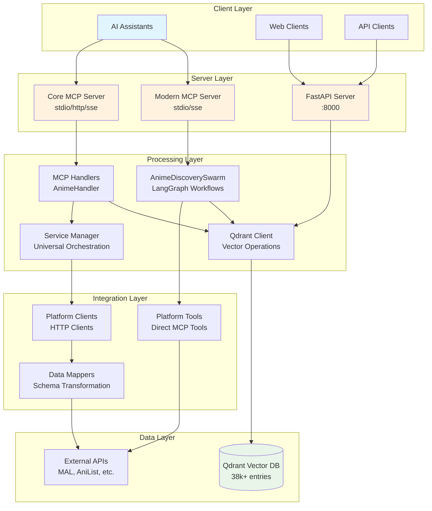
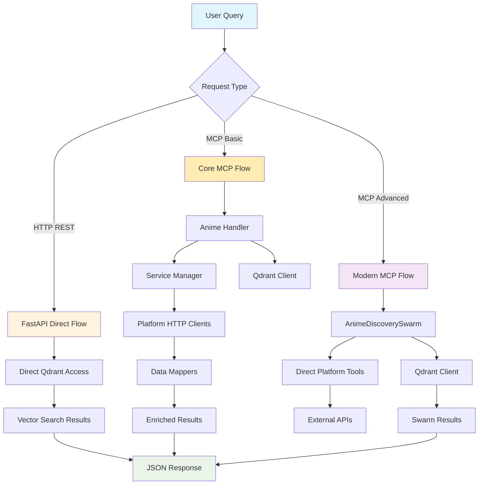

# System Architecture
# Anime MCP Server

## Overview

The Anime MCP Server is a multi-protocol system providing semantic anime search and discovery through FastAPI REST endpoints and MCP server integration. The system combines vector database search with external platform APIs to deliver intelligent anime recommendations.

## Core Architecture Principles

1. **Multi-Protocol Access**: REST API and MCP server protocols
2. **Vector-Based Search**: Semantic text and image search capabilities
3. **External Integration**: Unified access to 9+ anime platforms
4. **AI Workflow Integration**: LangGraph-based intelligent routing
5. **Stateless Design**: Scalable, containerized architecture
6. **Modern LLM Practices**: Tiered tool architecture with structured outputs (2025 modernization)
7. **Intelligent Orchestration**: Preserve advanced LangGraph routing while simplifying tool complexity

## System Architecture Overview

## Component Relationships

### Core Components

**Server Components:**
- `src/main.py` - FastAPI REST server entry point
- `src/anime_mcp/server.py` - Core MCP server (8 tools)
- `src/anime_mcp/modern_server.py` - Modern MCP server (LangGraph workflows)

**Processing Components:**
- `src/langgraph/react_agent_workflow.py` - AI workflow orchestration
- `src/services/service_manager.py` - Query routing and coordination
- `src/vector/qdrant_client.py` - Vector database operations

**Integration Components:**
- `src/integrations/clients/` - Platform-specific API clients
- `src/integrations/mappers/` - Data transformation layers
- `src/services/data_service.py` - Data processing pipeline

### Dependency Rules

- **Unidirectional Flow**: Server → Processing → Integration → External
- **No Circular Dependencies**: Components cannot depend on higher layers
- **Service Isolation**: MCP tools use service layer, not REST endpoints

## Solution Workflow

### Data Flow Patterns

The system operates through three distinct data flow patterns:

### Component Dependencies

**Server Layer:**
- `src/main.py` → FastAPI routes, global QdrantClient
- `src/anime_mcp/server.py` → Core MCP tools, AnimeHandler
- `src/anime_mcp/modern_server.py` → LangGraph workflows, platform tools

**Processing Layer:**
- `src/anime_mcp/handlers/anime_handler.py` → ServiceManager integration
- `src/langgraph/anime_swarm.py` → Multi-agent workflows
- `src/vector/qdrant_client.py` → Vector database operations

**Integration Layer:**
- `src/services/service_manager.py` → Universal query orchestration
- `src/integrations/clients/` → Platform HTTP clients
- `src/anime_mcp/tools/` → Direct MCP platform tools

## System Constraints

### Architectural Rules

**Dependency Flow:**
- Unidirectional dependencies: Server → Processing → Integration → External
- No circular dependencies between components
- MCP tools must not call FastAPI endpoints directly

**Data Access:**
- Vector database access only through `qdrant_client.py`
- External API calls only through Integration Layer
- Stateless application design

**Component Isolation:**
- Service Manager used by Core MCP handlers only
- LangGraph workflows use direct platform tools
- FastAPI endpoints have direct vector database access

## Data Layer

### Vector Database

**Qdrant Configuration:**
- Collection: "anime_database" with 38,894+ entries
- Text embeddings: 384D using FastEmbed (BAAI/bge-small-en-v1.5)
- Image embeddings: 512D using CLIP (ViT-B/32)
- Multi-vector search: Combined text + image capabilities

### External Platform Integration

**Supported Platforms:**
- MyAnimeList (MAL) - Official API with OAuth
- AniList - GraphQL API
- Kitsu - JSON:API with streaming data
- Jikan - MAL unofficial API
- AnimeSchedule - Real-time broadcast data
- Plus 4 additional platforms via web scraping

**Data Flow (Current - Under Modernization):**
- Platform APIs → Data Mappers → Universal Schema (being simplified)
- Rate limiting per platform (respects API constraints)
- Error handling with fallback strategies

**Data Flow (Modernized - 2025 Target):**
- Platform APIs → Direct Tool Calls → Structured Responses
- Tiered tool architecture for progressive complexity
- LangGraph intelligent routing preserved and enhanced